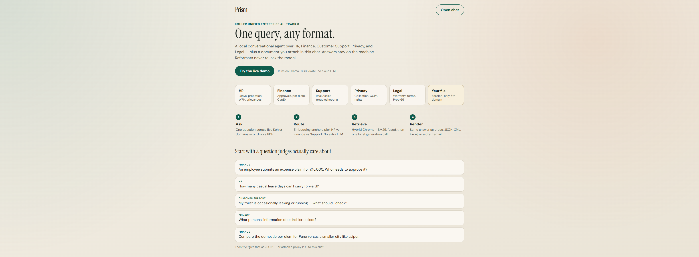
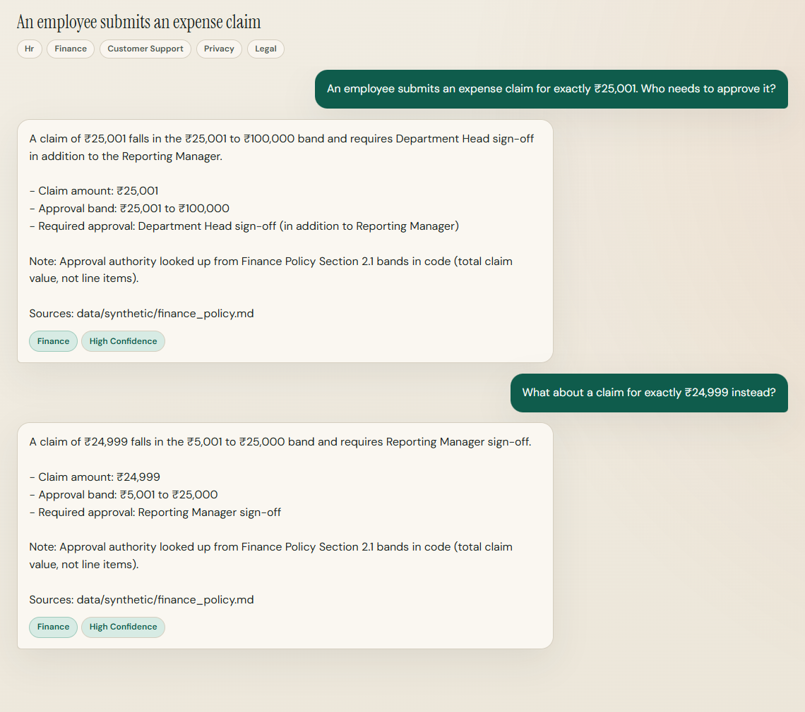

# Prism

**Kohler Unified Enterprise AI Agent** · Track 3 · Kohler-MITWPU AI Research Lab

Built by **Aryan Dani**. Individual submission.

One query, any format: a local conversational agent across five enterprise domains, plus the file you drop in chat. Runs fully offline via [Ollama](https://ollama.com/) on a laptop with an RTX 5070 (8 GB VRAM).

## Start here

| | Document | What it is |
|---|---|---|
| **1** | **[Jury deck](docs/pdf/deck.pdf)** | **The submission presentation.** 10 landscape slides. Read this first. |
| **2** | **[System handbook](docs/pdf/system_guide.pdf)** | Long-form teaching pass: every subsystem with a worked example. |
| **3** | **[Prompts & workflows](docs/pdf/prompts.pdf)** | Builder tooling, reconstructed briefs, and every shipped prompt plus workflow id. |

Markdown sources (if you want to clone the text, not the designed pages): [`docs/deck.md`](docs/deck.md) · [`docs/system_guide.md`](docs/system_guide.md) · [`docs/prompts.md`](docs/prompts.md).

In the live UI, every reply shows **Sources** (retrieved URLs) and a **Prompt / workflow** chip (`rag_canonical`, `policy_math`, `rbac_deny`, …) that maps 1:1 onto the prompts PDF.





---

## What it does

| Capability | How |
|---|---|
| **Five domains, one agent** | HR · Finance · Customer Support · Privacy · Legal/Compliance |
| **Multi-turn reasoning** | Session memory, anaphora ("that one…"), mid-conversation domain switching |
| **Clarification-seeking** | Asks a short question when domain routing is ambiguous. Does not guess. |
| **Honest no-answer** | Refuses to fabricate when retrieval is not confident (stricter for Legal/Privacy) |
| **Dynamic output formats** | One CanonicalAnswer object → prose / JSON / XML / Excel / email without re-retrieval |
| **Bring your own document** | PDF / DOCX / TXT / CSV mid-chat, indexed as a session-scoped sixth domain. Purged on chat delete and a 24h TTL. |
| **Role-based access (RBAC)** | Login with demo roles. Retrieval filters by Chroma `role_*` metadata before any chunk reaches the LLM. |
| **Voice** | Browser Web Speech: mic dictation + speak-answer (Chrome/Edge). No cloud STT. |
| **Cited sources & prompts** | Every answer lists retrieved sources. The workflow chip maps to the [prompts PDF](docs/pdf/prompts.pdf). |
| **Local-first** | Ollama + embedded Chroma. No cloud LLM. Uploaded documents never leave the machine. |

Maps and rationale (not the jury packet): [`docs/architecture.md`](docs/architecture.md) · [`docs/decisions.md`](docs/decisions.md)

---

## Quick start

### Prerequisites

- Windows 10/11 with ~8 GB NVIDIA VRAM (developed on RTX 5070 Laptop)
- [Ollama](https://ollama.com/) installed and running
- Python **3.11+** and [uv](https://github.com/astral-sh/uv)
- Node.js **20+**

### 1. Install

```powershell
# One-shot (Python deps in backend/ + Ollama models + frontend deps)
powershell -ExecutionPolicy Bypass -File scripts/setup.ps1
```

Or manually:

```powershell
cd backend
uv sync
cd ..

ollama pull nomic-embed-text
ollama pull qwen2.5:7b-instruct      # generation (default after bench)
ollama pull qwen2.5:3b-instruct      # session titles only
# or: powershell -File scripts/pull_models.ps1
# bench candidates: powershell -File scripts/pull_models.ps1 -All

cd frontend
npm install
cd ..
```

### 2. Build the vector index

Processed JSONL for all five domains is in `backend/data/processed/`. Build (or rebuild) the local Chroma + BM25 index:

```powershell
cd backend
uv run python -m prism.ingest.build_index
cd ..
```

Or from the repo root (fails loudly if any domain JSONL is missing or empty):

```powershell
powershell -ExecutionPolicy Bypass -File scripts/rebuild_index.ps1
```

Expected: **~519 chunks** indexed into collection `prism_kb` (includes HR records, compensation, warranty PDF fixture).

### 3. Run

```powershell
.\start.ps1
# Linux/macOS: bash scripts/start.sh
```

Open **http://localhost:5173**. Sign in with a demo account (printed on the login card).

**Smoke-test login (full domain access):** `alex.employee@prism.local` / `Prism2026!`

| Role | Example email | Sees |
|---|---|---|
| Customer | `priya.customer@prism.local` | Support, Privacy, Legal only |
| General Employee | `alex.employee@prism.local` | + HR/Finance policies |
| HR Staff | `riya.hr@prism.local` | + employee leave records |
| Finance Staff | `arun.finance@prism.local` | + CTC / compensation |

Shared password for all seeded users: **`Prism2026!`**

API docs: http://127.0.0.1:8000/docs · Health (no auth): http://127.0.0.1:8000/api/health

**Runtime KB upsert (bonus):**

```powershell
cd backend
uv run python -m prism.ingest.upsert --file eval/fixtures/k_3901_warranty.pdf --domain legal --source-id fixture-k3901-warranty --replace-source
```

---

## Tech stack (8 GB VRAM budget)

| Layer | Choice | Why |
|---|---|---|
| **Generation** | `qwen2.5:7b-instruct` (Q4) | Best Finance exactness + lowest latency in local bench |
| **Embeddings** | `nomic-embed-text` (~274 MB) | Tiny footprint so the 7B model keeps most of VRAM |
| **Titles** | Deterministic phrase table | No extra LLM. The 3B model is still pulled so health stays green. |
| **Vector store** | Embedded Chroma + BM25 sidecar | No separate server; one tagged collection for all domains |
| **Routing** | Embedding anchors + hit votes | **No LLM call** just to pick a domain |
| **Agent** | Hand-rolled Python state machine | Explicit, debuggable. No LangGraph/LlamaIndex overhead. |
| **API / UI** | FastAPI · React + Vite + TypeScript | Session sidebar, format bar, Excel download |

Full decision log (model bench, scrape strategy, 3-real/2-synthetic sourcing): [`docs/decisions.md`](docs/decisions.md) · PDF: [`docs/pdf/decisions.pdf`](docs/pdf/decisions.pdf)

### Model benchmark (12 golden questions, RTX 5070 8 GB)

| Model | Schema OK | Fact Recall | Finance Exactness | Avg Latency | Peak VRAM |
|---|---|---|---|---|---|
| **qwen2.5:7b-instruct** ★ | 100% | **74%** | **67%** | **6.4s** | **5143 MB** |
| qwen3:8b | 100% | 74% | 67% | 18.4s | 6241 MB |
| llama3.1:8b-instruct-q4_K_M | 100% | 74% | 33% | 9.9s | 6022 MB |
| mistral:7b-instruct | 100% | 78% | 33% | 15.4s | 5726 MB |

Qwen3 matches quality on this slice but is ~3× slower and uses more VRAM. Default stays Qwen2.5. Override anytime: `$env:PRISM_GEN_MODEL="qwen3:8b"`

Routing-only eval (40 questions): **92.1%** domain accuracy · **100%** hit@5 · ~76 ms avg

**Adversarial stress harness (39 cases, 13 categories):** **39 PASS · 0 PARTIAL · 0 FAIL · 0 NEEDS_HUMAN_REVIEW**. See [`backend/eval/results/stress/LATEST_REPORT.md`](backend/eval/results/stress/LATEST_REPORT.md). Covers numeric-boundary exactness, cross-domain multi-hop, silent domain switching, ambiguity/clarification, 12-turn memory, hallucination/honesty probes, jailbreak/prompt-injection/policy-tamper cases, output-format consistency, citation-domain integrity, session UX, and a 20-turn latency sweep.

---

## Knowledge domains

| Domain | Source | Notes |
|---|---|---|
| **Customer Support** | Real: full scrape of [assist.kohler.com](https://assist.kohler.com/en/sitemap) | ~331 unique articles; `__NEXT_DATA__` parse (no nav/footer noise) |
| **Privacy** | Real: Kohler Privacy Policy | Heading-boundary chunks; CCPA cookies URL currently 404 (flagged, not synthesized) |
| **Legal / Compliance** | Real: T&C, Prop 65, SDS, green-building, warranties | Warranty pages cross-tagged with Customer Support |
| **HR** | Synthetic: Meridian Fixtures HR Policy | Disclosed; structure informed by reference `BU_HR_Manual_.pdf` |
| **Finance** | Synthetic: Meridian Fixtures Finance Policy | Disclosed; deliberate ₹ approval bands for exactness demos |

HR/Finance are synthetic because no real internal Kohler manuals are public. That split is intentional and documented, not "whatever was easiest."

### Known limitations

- Expense **approval bands are by claim amount, not grade**. "If I get promoted, what’s my new expense limit?" is still the same ₹5k / ₹25k / ₹1L table unless the user also states a rupee amount.
- **Upload vs KB**: implicit questions only go to an attached file when the file is a closer dense match than the five KBs. Say "this document…" (or the filename) to force the upload path.
- **Latency scales with GPU contention.** On an 8 GB laptop GPU, all three Ollama models (7B generation + 3B titler + embedder) plus whatever else is drawing VRAM leave little headroom for the KV cache on longer conversations. Single-turn latency measured 2-15s with the GPU free vs 40-90s under contention on this dev box. The title model unloads immediately after each use (`OLLAMA_TITLE_KEEP_ALIVE=0`) to claw back ~2 GB, and a bounded request timeout (`PRISM_OLLAMA_TIMEOUT_S`) turns a stall into an honest "please retry". For a live demo, close other GPU-heavy apps first.
- **Privacy KB spans multiple jurisdictions** (US state law, Canada/PIPEDA, Brazil/LGPD, EU) with very similar boilerplate. Prism filters out chunks from a *different* named jurisdiction once the query clearly states one (see `filter_cross_jurisdiction_chunks`). The literal acronym "CCPA" never appears on Kohler's real public privacy page; California rights are described under "Shine the Light" / state-privacy-rights language instead.
- Customer Support / Privacy / Legal are **public Kohler pages**, not internal ticketing or employee PII stores.

---

## Architecture

```
User message
    │
    ├─ jailbreak / CFO-override? ──► deterministic refuse (no LLM)
    ├─ leave arithmetic pattern? ──► code-computed answer (policy_math)
    ├─ reformat request? ──► render(last_answer)     # no retrieval, no LLM
    ├─ clarify reply? ─────► force chosen domain
    ▼
Domain router (embedding anchors + hit votes)
    │ ambiguous? ──► ask clarifying question
    ▼
Hybrid retrieve (Chroma dense + BM25 → RRF; per-domain merge for multi-hop)
    │ low relevance? ──► honest no-answer
    ▼
One CanonicalAnswer (single Ollama JSON call)
    ▼
Renderers: prose | JSON | XML | Excel | email
```

---

## Project layout

```
Prism/
├── frontend/            # React + TypeScript + Vite chat UI
├── backend/             # FastAPI + Ollama + RAG agent
│   ├── prism/           # api/, core/, ingest/
│   ├── data/            # processed/ (commit), synthetic/, chroma/ (local)
│   └── eval/            # golden set, model bench, stress harness
├── docs/
│   ├── pdf/deck.pdf           # jury presentation (start here)
│   ├── pdf/system_guide.pdf   # long-form handbook
│   ├── pdf/prompts.pdf        # prompt + workflow inventory
│   └── assets/                # screenshots + prism_demo.mp4 (jury video)
├── scripts/             # setup/start/pull/rebuild + export_deck.py, export_system_guide.py, export_prompts.py
├── start.ps1            # thin wrapper → scripts/start.ps1
└── README.md
```

---

## Evaluation & validation

```powershell
cd backend

# Model comparison (optional limit for a faster pass)
$env:PRISM_BENCH_LIMIT="12"
uv run python -m eval.bench_models

# Routing + multi-turn behaviors
uv run python -m eval.run_eval

# Hand-review samples (20 random chunks / domain)
uv run python -m prism.ingest.validate

# Adversarial stress harness (sequential; API must already be on :8000)
# Smoke: $env:PRISM_STRESS_LIMIT="3"
uv run python -m eval.stress.harness
# → backend/eval/results/stress/LATEST_REPORT.md

# RBAC + conflict smoke (login as customer / employee / HR / finance)
uv run python -m eval.stress.rbac_smoke

cd ..
```

Validation reports: [`backend/eval/results/validation_summary.md`](backend/eval/results/validation_summary.md) · Stress harness: [`backend/eval/stress/README.md`](backend/eval/stress/README.md)

---

## Submission deliverables

Official email packet:

| Requirement | Location |
|---|---|
| **Presentation** | [`docs/pdf/deck.pdf`](docs/pdf/deck.pdf) (10 landscape slides) |
| **Prompts (brief requirement)** | [`docs/pdf/prompts.pdf`](docs/pdf/prompts.pdf) |
| Working prototype | This repo. See Quick start. |
| Demo video (~3 min) | Embedded file: [`docs/assets/prism_demo.mp4`](docs/assets/prism_demo.mp4) |

Supplementary (not required by the brief):

| Document | Location |
|---|---|
| System handbook | [`docs/pdf/system_guide.pdf`](docs/pdf/system_guide.pdf) |
| Architecture overview | [`docs/architecture.md`](docs/architecture.md) · [`docs/pdf/architecture.pdf`](docs/pdf/architecture.pdf) |
| Architecture decisions | [`docs/decisions.md`](docs/decisions.md) · [`docs/pdf/decisions.pdf`](docs/pdf/decisions.pdf) |

### Demo video

Embedded file (the brief allows a link or a file): [`docs/assets/prism_demo.mp4`](docs/assets/prism_demo.mp4)

1920×1080, 3:26, voiced walkthrough. Login as Alex, landing stats (5 domains / 39 of 39 / 8 GB / 0 cloud), Orion upload (INR 45,000), Finance ₹15,000 policy math, JSON / XML / Excel / Email from one answer, Support water callout, warranty follow-up.

Cue sheet: [`docs/demo_voiceover.md`](docs/demo_voiceover.md)

---

## Re-crawling (optional)

Polite, cached, ~1 req/s. Respects `assist.kohler.com/robots.txt`.

```powershell
cd backend
uv run python -m prism.ingest.crawl_assist
uv run python -m prism.ingest.parse_kohler_legal
uv run python -m prism.ingest.build_synthetic
uv run python -m prism.ingest.build_index
uv run python -m prism.ingest.validate
cd ..
```

Academic use only. Read-only crawl for this case study. Do not republish the scraped corpus outside the project deliverable.

---

## Configuration

| Env var | Default | Purpose |
|---|---|---|
| `PRISM_GEN_MODEL` | `qwen2.5:7b-instruct` | Answer generation |
| `PRISM_EMBED_MODEL` | `nomic-embed-text` | Embeddings / routing |
| `PRISM_TITLE_MODEL` | `qwen2.5:3b-instruct` | Legacy. Titles are a phrase table, not this model. |
| `PRISM_OLLAMA_KEEP_ALIVE` | `25m` | Keep the 7B/embed models warm between turns (`-1` = forever) |
| `PRISM_OLLAMA_TITLE_KEEP_ALIVE` | `0` | Title model (3B) keep-alive. Unloads immediately after each use to free VRAM. |
| `PRISM_OLLAMA_TIMEOUT_S` | `150` | Hard ceiling on a single Ollama call. A stall past this returns an honest no-answer. |
| `OLLAMA_HOST` | `http://localhost:11434` | Ollama endpoint |

---

## License / academic note

Submitted by **Aryan Dani** as an individual academic case-study prototype for the Kohler-MITWPU AI Research Lab. Kohler Assist / kohler.com content was scraped read-only under robots.txt and rate limits for this submission only, not for redistribution or commercial reuse. Synthetic HR and Finance policies are original student work, clearly disclosed as fictional.
